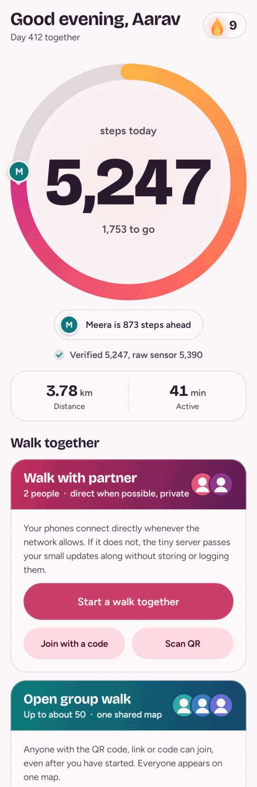
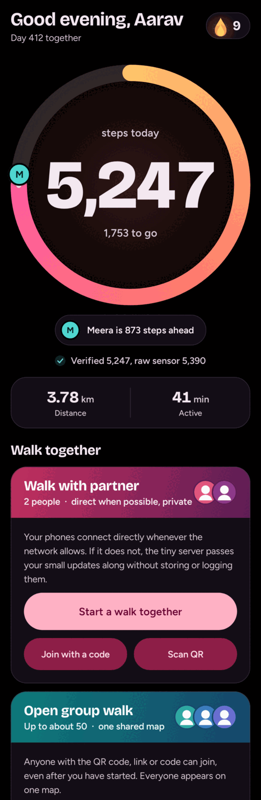
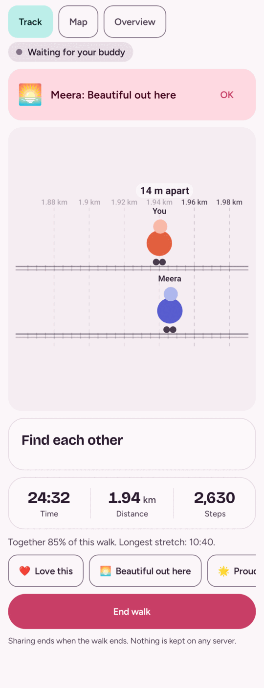
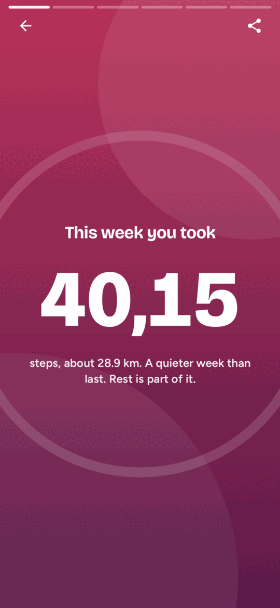

<div align="center">

# Walk Buddy

**Walk together. See each other. Stay side by side.**

A native Android app for evening walks with a partner, or an open group of up to about 50, with live steps, pace and a shared map. No accounts, no ads, no analytics.

[](https://github.com/Dante3750/walk-buddy/actions/workflows/ci.yml)
[](LICENSE)


</div>

> **Honest status (alpha 1.8):** the app compiles and CI is green (domain tests, server tests, debug APK). It has **not been run on a phone yet**, so GPS, the foreground service, WebRTC pairing, QR scanning, the widget and the Android 16 live update are untested on a device. See [Privacy and honest limitations](#privacy-and-honest-limitations).

## Why

Walking is better with someone, but most step apps are built for streaks and leaderboards. Walk Buddy was written for a couple who walk every evening, then widened to friends, families and walking clubs. It shows who is where, nudges gently when someone drifts a little apart, and builds a calm daily habit. There is no ranking and no shaming: steps from a group add up to one number.

## Features

**Steps hero**
- One huge, centred step count that counts up inside an animated gradient ring, with a goal marker and a glow while you walk.
- *Verified* steps next to raw sensor steps: vehicle and bicycle time and impossible bursts are left out.
- Streak flame with rest tokens, 12 badges, hour-by-hour "best walking hour", month heat-map, weekly recap, gentle-day and rest-day modes, confetti when you reach the goal.

**Partner mode** (2 people, phone to phone)
- Pair by code, link or QR. Live distance, ahead or behind, pace zone, a "together" score and soft catch-up nudges (with cooldowns, so they never spam).
- Couple extras: walk dates, "Our week", shared odometer milestones, quick reactions, anniversary countdown, favourite spots.
- Live data goes over an encrypted WebRTC data channel when a direct path exists; otherwise a few tiny updates are relayed through the server (see [How the partner link works](#how-the-partner-link-works)). A small indicator says **Direct**, **Via server** or **Reconnecting...** and how long ago your buddy was last seen.
- **Track view** (the default on the live screen): a metro-line picture with one lane per walker, your chosen boy, girl or neutral walker and colour, movement proportional to real distance, a gap indicator, a station every kilometre, a glow when you are together, and gentle cues for who is leading or catching up. It redraws at a low rate and stands still with Reduce motion or Battery saver. Switch between Track, Map and Overview.
- **Walks together** (Home and Settings): every finished partner or group walk is saved on your phone, grouped by month, with a detail page, a Track replay, delete or clear all, and GPX or JSON export. Nothing about it leaves your phone.

**Open group walks** (up to about 50, with QR join)
- Create a group: optional host approval, time limit (1 to 8 h), optional shared step goal, meeting point.
- Join by **QR scan**, `walkbuddy://` or https link, or the 6-character code, even after the walk has started.
- People tab with initial avatars, role tags (front, back), "a little apart" shown softly, and one shared steps bar. Quiet mode, sweeper role, and a switch to stop sharing location.
- Host can approve, remove, set the goal and meeting point, or end the walk for everyone.

**Map** (both modes)
- Offline canvas map: a dot with initial and a trail per person, follow me or whole group, meeting-point flag, scale bar. No network request by default.
- Opt-in OpenStreetMap tiles (with attribution) and opt-in local GPX route saving.

**Health, food and calorie tools** (all opt-in, wellness only)
- Adaptive daily goal, pace zones, active minutes against the 150 min/week guidance, sitting-break reminders.
- Calories: hidden by default, always shown as an estimated range, net of resting energy, no deficit or weight-loss targets.
- Refuel ideas: general, balanced suggestions with a vegan / vegetarian / egg switch. No diets, no targets, no BMI.

**Privacy**
- No accounts, no analytics, no ads, no microphone, no voice or video. Camera only on the QR scan screen, nothing saved.
- Your data lives on your phone: CSV export and delete-all in Settings.

**Around the system:** Glance home-screen widget, Quick Settings tile, shortcuts, edge-to-edge, predictive back, tablet layouts, light, dark (true black) and optional dynamic colour, English and Hindi system strings.

## How the partner link works

Two layers run at once, so a walk with someone far away does not fall apart when one path fails:

1. **Direct (preferred).** A WebRTC data channel between the phones with several public STUN servers, all candidate types, continual candidate gathering and an ICE restart when the path breaks. A watchdog repairs a down link with a grace period, then exponential backoff with jitter, and rebuilds the connection from scratch every few failed restarts. A change of network (Wi-Fi to mobile data) triggers a restart straight away.
2. **Via the server (hot standby).** The room on the Walk Buddy server also relays tiny messages (position, hello, pins, reactions, a short day summary), a thin trickle while the direct link is healthy and everything small while it is down. Every message carries a running number, so a copy arriving on both paths is used once and an older copy never overwrites a newer one. The server stores and logs nothing.

Your walk is always recorded on your phone first; a dropped link never loses it. While the link is down the screen keeps your buddy's last position, marked as last seen some time ago. A foreground service keeps the walk alive with the screen off, and the server socket is kept alive with the existing 40 s ping.

**Why there is no TURN relay.** A TURN server relays full media and needs a paid, always-on host with credentials; this app has no accounts and a free sleeping server. The server relay above carries only a few hundred bytes every few seconds, which is all a walk needs. **On strict networks** (carrier-grade or symmetric NAT, some corporate Wi-Fi) the direct channel may never open: the link then shows *Via server* for the whole walk and works the same, just not phone to phone. If the server itself is asleep, the first connection can take up to about a minute.

## How step counting works

Steps count all day, on their own, and have nothing to do with walk sessions.

- **Sensor.** The phone's hardware step counter (`TYPE_STEP_COUNTER`) keeps counting even while Walk Buddy is closed. A small foreground service (a quiet "N steps today" notification, type *health*) keeps one batched listener registered; with the screen off the sensor hub holds readings for up to 5 minutes and hands them over together. If the phone has no step counter, the step detector is used, then the accelerometer (approximate, and only while the phone is awake).
- **Baseline and delta.** The counter is cumulative since boot. Walk Buddy stores the last value it saw and adds the difference on every reading, so steps taken while the app was killed are recovered on the next read. A lower value (or a later boot time) means the phone rebooted, and the new value is then the delta.
- **Stored first.** Each update writes the day total and the new baseline in one Room transaction, keyed by local date. A delta that spans midnight is split across the days (DST aware). The screen only reads the database, so numbers survive the app being killed, and no network is involved.
- **Safety net.** One WorkManager job (about every 30 minutes, not when the battery is low) reads the counter even if the service was stopped. Boot and app-update receivers restart everything; Android 12+ sometimes refuses a background service start, and the safety net covers that. There are no alarms.
- **Walks reuse the same feed.** A walk or group walk reads the same readings and never writes daily steps itself, so nothing is counted twice.
- **See it working.** Home shows the live number while the app is open. Settings has a "Step counting health" card: permission, sensor, last reading, service, battery.

### Troubleshooting: steps are not counting

1. **Permission.** Android 10+ keeps step sensors silent until *Physical activity* is allowed. Home shows an "Allow step counting" card; if Android stopped asking, the card offers "Open app settings" (Permissions, Physical activity, Allow).
2. **Battery optimisation.** Many phones stop background apps. Settings, Step counting health, "Battery settings" opens the system list; set Walk Buddy to *Unrestricted* / *Don't optimise*. Walk Buddy never requests this silently.
3. **Per-maker extras.** Xiaomi/MIUI (Autostart on, battery saver "No restrictions"), Samsung (Never sleeping apps, remove from Deep sleeping), Huawei (App launch: manage manually), OnePlus/Oppo/Vivo (allow background activity and auto-start), Pixel (Unrestricted). The per-phone steps are collected at [dontkillmyapp.com](https://dontkillmyapp.com/).
4. **Notification hidden.** On Android 13+ the quiet notification needs the notification permission to be visible, but counting does not depend on it. Swiping it away does not stop counting.
5. **Force stop.** "Force stop" in Android settings halts all background work until you open Walk Buddy again. The hardware counter keeps counting, and the first read after you reopen recovers those steps.
6. **Reboot.** The hardware counter restarts at zero after a reboot; steps taken between the last reading and the shutdown cannot be recovered by any app. Steps after the reboot are counted from the first reading.

## Battery

Walk Buddy is built to cost very little when you are only counting steps, and to spend power only where a walk really needs it. Nothing below was measured on a phone (see the last bullet); it is what the code does and what Android's power documentation says it should cost.

**What costs power, roughly in order**

1. **GPS and the screen during a walk.** Continuous location is the single biggest drain, then the display.
2. **The network during a group walk.** Every update wakes the radio; a larger group means more traffic to receive.
3. **Waking the CPU.** Each wake-up (timers, sensor batches, notification updates, database writes) costs far more than the work it does.
4. **Decorative animation** on screen (rings, glows, flame).
5. **Step counting itself** is nearly free: `TYPE_STEP_COUNTER` is counted by a low-power sensor hub, not by the app.

**What the app does about it**

- **Steps, screen off.** The listener asks the sensor hub to batch readings for up to 5 minutes (10 in Battery saver), so the CPU sleeps in between. The counter is cumulative and held in hardware, so a late delivery loses nothing; the app only learns the number later. With the app open readings arrive at once; during a walk with the screen off they arrive every 5 s (10 s in Battery saver). Delivery bursts are merged per clock hour before they are written, so the hourly and midnight splits stay right.
- **No wake locks, no alarms, no timers.** Nothing in the app takes a wake lock or schedules an alarm. Background safety is one WorkManager job (about every 30 minutes, skipped when the battery is low, longer gaps in Battery saver) that Android can defer in Doze. The old 15-minute alarm is cancelled on update. The step service no longer polls for midnight; it listens for the system's date-changed broadcast.
- **No GPS unless a walk is running.** Location is requested only while a partner or group walk is tracked, and stops the moment it ends. Rate: about every 3 s / 3 m while moving with the screen on, 5 s / 5 m with it off, backing off to 6-10 s when you stand still (20 s in Battery saver). GPS is the walk's source; the network provider is only a slower backup.
- **Group and partner traffic.** Updates are spaced by the same policy: about 3-5 s while moving, 8 s while still, a little slower for groups of more than 10 and in Battery saver, and never slower than 10 s, so nobody looks lost (the "lost" timeout is 30 s). Bursts (several people joining at once) are coalesced into one message. Reconnects use exponential backoff with jitter, wait for the system's "network available" callback instead of retrying into a dead link, and stop after a few tries. Ending a walk closes the socket, the peer connections and the network callback. One shared HTTP client replaces one per socket; keep-alive pings are every 40 s.
- **Notifications.** The all-day step notification is updated only when the number moved by about 100 steps and 5 minutes passed (20 steps / 15 s with the app open, and at once when you open it); the walk notification at most every 10-30 s. Both are silent, low importance and alert only once.
- **Widget and storage.** Widget refreshes and the history read behind them are spaced (a minute with the app open, minutes otherwise). Step writes are batched by the sensor latency.
- **UI.** The decorative glow and flame run at 10-12 fps, only while the screen is showing, and redraw instead of recomposing; Battery saver switches them off like "Reduce motion". Screens collect state with the lifecycle (nothing is collected while the app is stopped), the Settings page no longer polls every 2 s, and screen-specific data (trends, recap, badges, fuel) is computed only while a screen needs it. The optional OSM tile cache is capped at 8 MB.
- **Policy in one place.** `SamplingPolicy` (pure Kotlin, unit tested in `SamplingTest`) decides sensor latency, location rate, send rate, tick rate and notification and widget spacing from: screen visible, walk active, moving, group size, Android Battery Saver, Walk Buddy's own saver, charging.
- **Settings, Battery card.** Shows the current mode, what it means in plain words (generated from the same policy), tips, and a *Battery saver mode* switch for extra-low rates. Android's Battery Saver turns the same rates on automatically.

**Honest expectations**

- All-day step counting should be a small fraction of a percent of the battery per day on a phone with a hardware step counter, because the foreground service mostly sleeps. That is an expectation from how the sensor hub works, not a measurement.
- A walk with GPS on and the screen off is dominated by GPS and is not made free by any of this; the policy reduces how often GPS and the radio are used, it cannot remove them. A 30-minute walk should cost a few percent; a long group walk more, depending on the phone, signal and group size.
- Phones without a step counter or step detector fall back to the accelerometer, which only works while the app is open or a walk is running. Walk Buddy deliberately does not run a background service just for that, so on such phones steps outside walks are counted only while the app is open.
- The foreground service shows an ongoing notification (required by Android). Choosing *Unrestricted* battery use helps steps survive aggressive phone makers, at a small cost; leave it on *Optimised* if your steps keep counting.
- **Not measured.** No device was available. Real numbers (for example `adb shell dumpsys batterystats`, Battery Historian, or a day of normal use with and without Battery saver) are still to be collected; please report them.

## Screenshots

| Home | Home (dark) | Live walk | Weekly recap |
|:---:|:---:|:---:|:---:|
|  |  |  |  |

> **These images are from alpha 1.2 and are not refreshed.** Alpha 1.4 changed the home screen (the two walk-mode cards) and the group screens, but CI screenshots are only available as a workflow artifact that GitHub lets you download after signing in, and they could not be fetched automatically. To see the current UI, download the `screenshots` artifact from the [latest CI run](https://github.com/Dante3750/walk-buddy/actions/workflows/ci.yml?query=branch%3Amain+is%3Asuccess), or build the APK.

## Quick start

### Install the debug APK

1. Open the [latest green CI run](https://github.com/Dante3750/walk-buddy/actions/workflows/ci.yml?query=branch%3Amain+is%3Asuccess) and download the `walk-buddy-debug-apk` artifact (GitHub asks you to sign in for artifacts, even on a public repo).
2. Unzip, copy `app-debug.apk` to the phone and install it (allow "install unknown apps" for your file manager). It is a debug build for trying the app, not for the Play Store.
3. No buddy yet? Turn on **Demo mode** (onboarding or Settings): no permissions and no second phone needed.

### Build it yourself

Android Studio Ladybug (2024.2) or newer, JDK 17+. Open the folder and run `app`, or:

```bash
./gradlew :app:assembleDebug
```

### The server

The app uses one **built-in server**, `wss://walk-buddy-server-sxpz.onrender.com` ([health](https://walk-buddy-server-sxpz.onrender.com/health)), for partner pairing and open groups. There is no server setting in the app, and an invite link or QR code cannot point the app at another server. The free host sleeps when idle, so the first connection after a break can take up to a minute; the app says "Waking up the server" and retries by itself.

**Self-hosting:** run the server in [`server/`](server/README.md) (`cd server && npm install && npm start`, or Docker, behind TLS), then change the single constant `ServerConfig.URL` (and `HEALTH_URL`) in `domain/src/main/kotlin/com/walkbuddy/domain/ServerConfig.kt` and rebuild the app. To share a build with friends see [`docs/SHARING.md`](docs/SHARING.md).

### Join a group walk

1. **Scan:** Home, Open group walk, Join a group, **Scan a QR code**. Camera permission is asked only there.
2. **Link:** tap a `walkbuddy://group/...` link (or the server's `/g/CODE` page link), or paste it into the join screen.
3. **Code:** type the 6-character code.

To host: Home, Open group walk, **Create a group**, then share the QR, code or link from the **Invite** tab.

## Architecture

```
domain/   pure Kotlin JVM, no Android: protocol and QR encoder, geo, together/nudge/pace engines, group engine
          (centroid, stragglers, roles, collective goal), verified steps, health, calories, refuel catalogue (unit tested)
app/      Android: Compose UI, Room + DataStore, sensors, WebRTC peer link, group session, foreground service, notifications
widget/   Glance home-screen widget, its own module (switch off with -Pwidget=false)
server/   Node 18+ signaling and group relay, in-memory rooms, Dockerfile, node --test tests
```

Partner mode: phones swap WebRTC offers through the server, then talk directly; each phone runs the same pure-Kotlin engine on what it receives. Open groups: phones send small validated updates to the server, which relays them to that one group and keeps nothing. The wire formats are versioned JSON, documented in [`server/README.md`](server/README.md).

Tests and CI:

```bash
./gradlew :domain:test                 # 340 tests
scripts/domain-test-offline.sh         # same tests with only the jars inside a Gradle distribution
cd server && npm test                  # 49 tests
```

CI (`.github/workflows/ci.yml`) runs the server tests on Node 18 and 22, then `:domain:test`, `:app:assembleDebug` and lint (reported, not blocking), uploads the debug APK, and renders every screen with Paparazzi in a separate non-blocking job (the `screenshots` artifact). It never pushes a branch or a tag.

## Privacy and honest limitations

- **Where data goes.** Steps, walks, spots and settings stay in a local database (`allowBackup` is off). Partner mode sends live data phone to phone. In an open group your name, steps and a possibly blurred position (exact, about 100 m or about 500 m grid, applied on your phone) go to the server you chose, which relays them to that group and stores nothing. Other members' data is never saved on your phone.
- **Trust.** Anyone with the code or QR can join an open group unless the host approves each person, so share it only with people you trust. The server operator can see IP addresses and traffic while it passes through; the built-in server is a free personal host; self-host if you need more control. STUN uses Google's public servers by default.
- **Not tested on a device.** No phone has run this build. GPS behaviour, the foreground service, haptics, QR scanning, map gestures, OSM tiles and WebRTC connectivity are untested.
- **No TURN relay.** The direct channel uses STUN only, by design. On carrier-grade NAT and strict Wi-Fi it can fail; the walk then runs through the server relay (tiny updates only, nothing stored). Neither path has been tested between two real phones.
- **Health Connect** (`-PhealthConnect=true`) is optional and currently fails to build in KSP (non-blocking in CI).
- **Calorie table** values were transcribed from memory of the 2011 Compendium of Physical Activities; verify them against the published tables.
- **Steps outside walks** are only plausibility-checked; vehicle filtering needs GPS and applies during walks.
- The built-in server is a free host: it sleeps when idle (first connection up to ~1 minute) and has no uptime guarantee.
- General wellness only: not a medical device, no medical or nutrition advice.

## Roadmap

- First real-device pass: GPS jitter and nudge thresholds, pairing, group walks.
- Walk restore after the app process is killed mid-walk (the finished part is not resumed today).
- BLE heart-rate strap and a walking-steadiness trend (opt-in).
- Baseline profile, group-screen screenshot tests, full Hindi translation.

## Contributing

Issues and pull requests are welcome. Keep logic that deserves tests in `:domain` (or `server/`), run `./gradlew :domain:test` and `cd server && npm test` before pushing, and keep to the privacy rules above: no accounts, no analytics, no new permissions without a clear reason. Android code only compiles on CI in this project, so check the CI run on your change. Release history: [CHANGELOG.md](CHANGELOG.md) and [RELEASES.md](RELEASES.md).

## Licence

MIT, see [LICENSE](LICENSE). Bundled fonts (Bricolage Grotesque, Figtree) are SIL OFL, see `docs/OFL-*.txt`.
